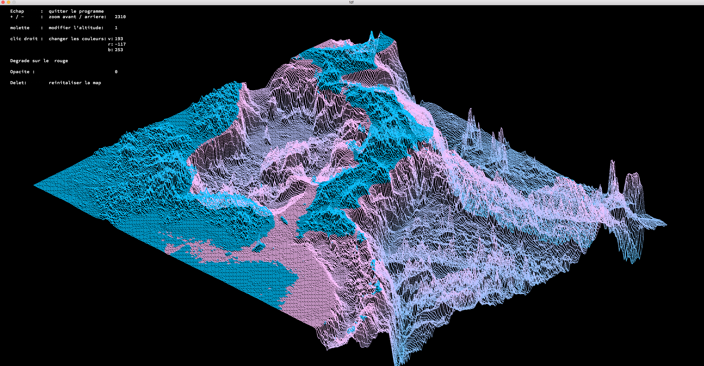

# FDF Project

## 🌟 Project Overview

Welcome to the FDF Project! Ever wanted to see your 2D height maps come to life in 3D? Our tool does just that, converting flat maps into stunning 3D wireframe models. It's like magic for your data!

## 🔑 Key Features

- **Height Map to 3D**: Turn 2D maps into 3D wireframe models.
- **Interactive Views**: Rotate, zoom, and pan to explore your models from any angle.
- **Customizable**: Change wireframe colors, thickness, and more.
- **Real-Time Rendering**: Smooth and responsive visualization.
- **Cross-Platform**: Works on multiple platforms.

## 💡 Project Motivation

Why did we create FDF? Because traditional 2D maps just don't cut it. We wanted a way to see terrain in 3D, making it easier to understand and analyze. Perfect for geographers, architects, game developers, and more!

## 🛠️ Technical Overview

- **Language**: Built in C for speed and efficiency.
- **Graphics**: Uses MiniLibX library for rendering.
- **Algorithm**: Combines Bresenham's line algorithm with matrix transformations.

## 🚀 How It Works

1. **Data Input**: Start with a height map file.
2. **Data Parsing**: Read and store the data in a 2D array.
3. **3D Transformation**: Convert 2D points into 3D coordinates.
4. **Wireframe Generation**: Draw lines between points to create the wireframe.
5. **Rendering**: Display the model and interact with it.

## 🌱 Future Enhancements

- **Texture Mapping**: Add textures for a more realistic look.
- **Shading Techniques**: Improve visual depth with shading.
- **UI Improvements**: Make the interface even more user-friendly.
- **Performance Boosts**: Optimize for larger and more complex models.

## 🎉 Conclusion

The FDF Project transforms your 2D height maps into dynamic 3D wireframes. It's perfect for anyone looking to explore terrain data in a new, engaging way. Whether for work, study, or fun, FDF brings your data to life!
